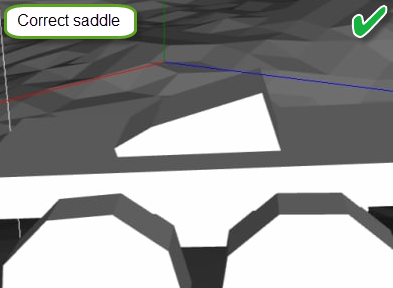

# Truck

The `<Truck>` tag is a root tag in the XML files of classes of the truck and, for *SnowRunner*, the trailer.

Attributes:

-   `Type="Trailer"`  
    *In Expeditions:*  
    Not used.  
    *In SnowRunner:*  
    This attribute specifies whether the truck or the trailer is described. For trucks, this attribute can be omittied.

-   `AttachType="Saddle"`  
    *In Expeditions:*  
    Not used.  
    *In SnowRunner:*  
    This attribute is used for trailers and semitrailers only. It defines the attachment type used when the trailer or semitrailer is attached to the truck. It is important to specify the value of this attribute correctly since it affects the mechanics of respawning of the trailer or the semitrailer after passing through the Gateway. Particularly, to respawn the trailer or the semitrailer and correctly and attach them to a truck after that, the game needs to specifically position them relative to the truck. To do so, the game needs to know how the trailer/semitrailer is attached to the truck: via the drawbar, or via the saddle. Incorrectly specified `AttachType` can lead to wrong behavior and issues after passing Gateways.
    Possible values of this attribute are the following:

    -   `"Drawbar"` – means that the attachment is performed via the drawbar. This is the default value of the attribute, and this value is also used if the attribute is omitted.  
        Typically, most of the **trailers** (*not* semitrailers) use this type of attachment.

    -   `"Saddle"` – means that the attachment is performed via the saddle.    
    Typically, most of the **semitrailers** (*not* regular trailers) use this type of attachment.
        
        **NOTE #1**: Most of trailers for scouts are attached via the drawbar (to a trailer hitch), so this attribute can be typically omitted for them. However, if you create a custom trailer for a scout that will be attached via the saddle, you will need to set the corresponding value of the AttachType attribute for it.
        
        **NOTE #2**: When modelling collision meshes for bones of a saddle do not make them too thin (as illustrated below). Too thin saddles can cause collision issues. This is a general rule that applies to most of other collision meshes too.
        
         

        **WARNING**: This attribute was added in *DLC 5* (*"Season 5: Build & Dispatch"*) of *SnowRunner* and, starting with this update, the game will take the value of this attribute into account. So, if it is absent for a trailer/semitrailer, the game will consider that it has the `"Drawbar"` attachment type. If it is not correct for your trailer/semitrailer mods, you will need to explicitly specify the correct `AttachType` value in their configuration. This is especially actual for authors of semitrailer mods since most of the semitrailers must have the `AttachType`=`"Saddle"` value (otherwise they may have issues while being spawned after Gateways). However, created mods of trailers with the drawbar attachment require no additional actions and can be left unchanged.

-   `OriginalTruck="chevy_apache"`  
    This attribute allows you to link your truck mod to the original truck available in the game or within its particular DLC by specifying its identifier as the value of the attribute.  
    If you link your truck mod to a truck available in a DLC, your mod will be available only for players who have purchased this DLC. See [Modding of DLC Trucks][modding_of_dlc_trucks] for details.

-   `FarmingTrailerType="Cultivator"`  
    *In Expeditions:*  
    Not used.  
    *In SnowRunner:*  
    This attribute marks that this trailer can be used for farming and specifies its particular (farming) sub-type. This attribute with one of 3 possible values is mandatory for all farming trailers. Not used for trucks and non-farming types of trailers.  
    Possible values:

    -   `"Cultivator"` – this farming trailer type is typically used for cultivating the farming area, to make the ground plowed.

    -   `"Planter"` – this farming trailer type is typically used for planting the vegetation on the farming field.

    -   `"Harvester"` – this farming trailer type is typically used for harvesting the farming field.
        
        **NOTE**: When creating a Farming trailer in *SnowRunner*, along with `FarmingTrailerType`, you will also need to add a certain amount of [`<FarmingBoundingBoxN>`][farmingboundingboxn] tags for all parts of the trailer that interact with the farmimg field. For more details, see [Farming Trailers][farming_trailers].

[modding_of_dlc_trucks]: ./../../additional_info_on_trucks/modding_of_dlc_trucks/modding_of_dlc_trucks.md
[farmingboundingboxn]: ./physicsmodel/farmingboundingboxn/index.md
[farming_trailers]: ./../../additional_info_on_trucks/farming_trailers/farming_trailers.md