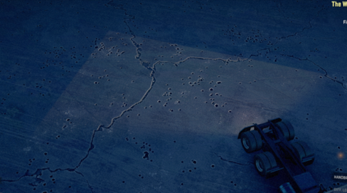

# HeadLight (in ModelAttachments)

## Overview
The `<HeadLight>` section within [`<ModelAttachments>`][modelattachments] describes light rays simulation and a flare of the headlights.

**TIP**: For general definitions of "Flare", "Model" and "Light" lights, see [`<ModelAttachments>`][modelattachments]. For details on them, see [`<Flare>`][flare], [`<Model>`][model], and [`<Light>`][light]. 

Particularly, in this `<HeadLight>` section:

-   The light rays simulation of the headlights is described by a set of [`<Model>`][model] tags.
-   The flares of the headlights is described by a set of [`<Flare>`][flare] tags. 

These tags are used here the same way they are used in the [`<StopSignals>`][stopsignals] section.

**NOTE**: Headlights are turned on when the player presses the corresponding button in the game. In the case of the Keyboard, `L` is the default button for enabling Headlights.

## Two `<HeadLight>` tags
The light of headlights is described in the XML model of the truck in the two different places:

-   The [`<HeadLight>`][headlight_in_truck] tag in the [`<Truck>`][truck] section – describes the *main light* of the headlights is described. See this [`<HeadLight>`][headlight_in_truck] tag for details.

-   The `<HeadLight>` tag in the [`<ModelAttachments>`][modelattachments] section – describes the light rays simulation of the headlights and flares of the headlights, see [above](#overview).

## Influence of Terrain Blocks
The light specified by `<HeadLight>` tag in the [`<ModelAttachments>`][modelattachments] section is clipped based on terrain blocks:

The light specified by the [`<HeadLight>`][headlight_in_truck] tag in the [`<Truck>`][truck] section is not clipped this way. Terrain blocks do not affect it. See this [`<HeadLight>`][headlight_in_truck] tag for details.

[modelattachments]: ./../index.md
[model]: ./../stopsignals/model/index.md
[flare]: ./../stopsignals/flare/index.md
[light]: ./../stopsignals/light/index.md
[stopsignals]: ./../stopsignals/index.md
[truck]: ./../../../truck/index.md
[headlight_in_truck]: ./../../headlight/index.md