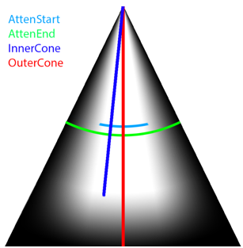
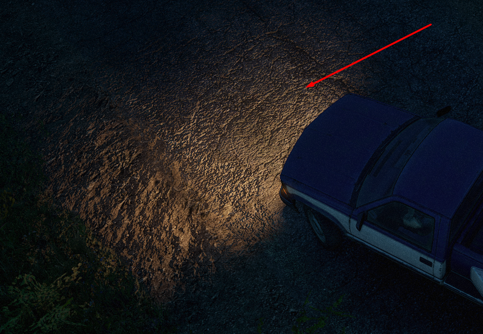

# Light

The `<Light>` tag describes a source of the light that illuminates objects and surfaces in a cone of a light beam.

For example, in *SnowRunner*, the operation of this light source looks like this:  

In *Expeditions*, it looks the same way.

Attributes:

-   `Pos="(3.759; 1.169; 0.944)"`  
    Light source position.

-   `Dir="(1; -0.3; 0)"`  
    Direction vector.

-   `AttenStart="1"`  
    The start of attenuation, in meters.

-   `AttenEnd="5"`  
    Ray length, in meters. By default: `0`.

-   `InnerCone="20"`  
    Inner cone (the light does not scatter). By default: `360`.

-   `OuterCone="100"`  
    Outer cone. By default: `0`.

-   `Color="g(255; 186; 112) x 2"`  
    Light color and brightness multiplier. The `g` value is gamma correction and `x 2` is brightness.  
    Default value: `"(0; 0; 0)"`.  

-   `ParentFrame="BoneCabin_cdt"`  
    A bone from the hierarchy of the physical model, which the Light is attached to. If the parameter is not specified, then this is a root bone.
