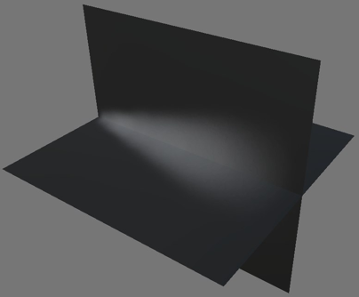
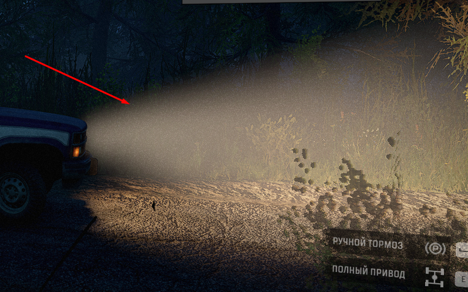

# Model

The `<Model>` tag describes the light rays simulation. 

This simulation uses the semi-transparent model, which is highlighted by the `Light` source. This creates a visual effect of light rays.

Typically, the model is the FBX model of a cross that is made from two intersecting planes. On these planes, there is a white texture with transparency in the form of a beam.

For example, in *SnowRunner*, the effect from this `Model` looks like this:  

In *Expeditions*, it looks the same way.

Attributes:

-   `Org="(3.759; 1.169; 0.944)"`  
    The position of the origin of coordinates of the model.

-   `Dir="(3.759; 1.169; 0.944)"`  
    Direction vector.

-   `Mesh="env/light_ray"`  
    The path to the FBX of the model from the `.../meshes` folder.

