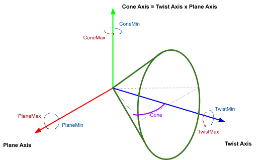
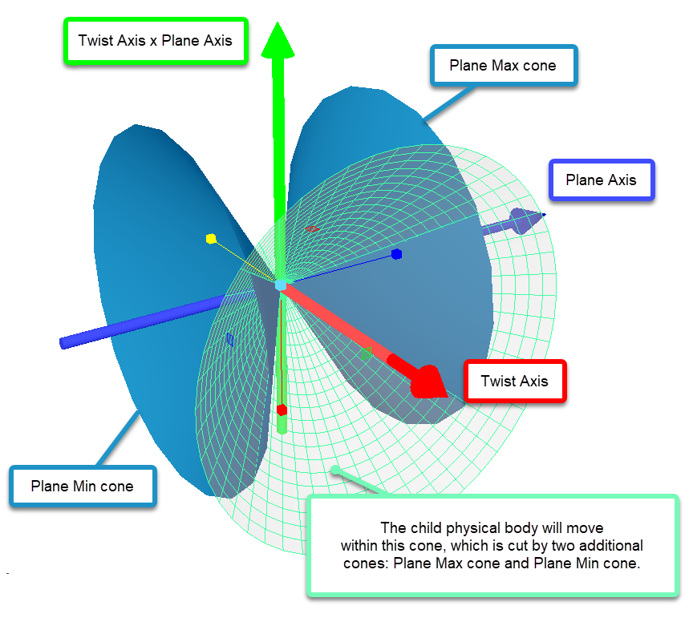

# Constraint

A way to bind a physical body to its parent body.

If the physical body is considered a bone, then Constraint is the joint between this bone and its parent. It can be motionless or have single or multiple angular or linear degrees of freedom.

The root bone of the truck does not have a Constraint tag since it is not attached to anything.
The root bone of the addon has a Constraint since the addon is an attachable part of the truck.

**NOTE**: *For SnowRunner*, the root bone of the trailer has no constraint since the trailer can exist independently on the map. However, in order to determine how the truck interacts with the trailer, the trailer constraint is separated and specified in the [`<TruckData>`](./../../../truckdata/index.md). This constraint describes the interaction of:

-   The parent bone, which is the truck bone described in the XML of the truck in the `<Socket>` tag: `<Socket ParentFrame = "BoneBack_cdt" />`
    *and*
-   The addon bone, which is described in the XML of the trailer: `<InstallSocket ParentFrame = "BoneHandle_cdt" />`.

Any two bones of the trailer and the truck can participate in this interaction, regardless of hierarchies.

Attributes:

-   `PivotOffset="(1; 0.1; 0)"`  
    Offset of the Pivot. Pivot is the coordinate of the bone in the FBX file. Rotations of constraints of the `Hinge` and `Ragdoll` types are performed relative to it.

-   `Type="Hinge"`  
    *(Mandatory.)* Connection type (Constraint type).  
    Values:
    -   `Fixed` - fixed connection (constraint). If the `LinearLimitsX, Y, Z` attributes (see descriptions of these attributes below) are *not* used with this constraint, it describes motionless, fixed connection. Otherwise, if the `LinearLimitsX, Y, Z` attributes are used, the connection receives degrees of freedom along the specified axes within the specified limits. For example, if all these three linear limits are not null, this connection can be used to describe the motion of an unfixed brick in a box (without rotation).

    -   `Ragdoll` - Rotation by all axes within specified limits. The connection is suitable for describing the shoulder joint or bell tongue.

    -   `Hinge` - Rotation by one axis within specified limits. This type of constraint is suitable for describing a door hinge.

    -   `UnlimitedHinge` - unlimited rotation along a given axis.

    -   `Prismatic` - linear movement along one axis within specified limits. This type of constraint is suitable for the description of a pump, hydraulics, and so on.

    -   `Rigid` - a rigid connection of the **root bone** of the addon with the bone of the truck. In this connection, the collision object of the root bone becomes the part of the bone of the truck. For example, this connection is necessary for describing bumpers, since Havok constraints (everything above) do not strictly cut off linear deformations along the axes that are expected to be fixed. And, for example, when a bumper with a fixed constraint collides with a wall, this bumper springs and, in case of strong vibrations, the vehicle can break into pieces due to the resonance. This constant only works on the root bone of the addon.

-   `LinearLimitsX="(-0.01; 0.01)"`  
    Limits of linear movement along the `X` axis for the `Fixed` constraint type.

-   `LinearLimitsY="(-0.01; 0.01)"`  
    Limits of linear movement along the `Y` axis for the `Fixed` constraint type.

-   `LinearLimitsZ="(-0.01; 0.01)"`  
    Limits of linear movement along the `Z` axis for the `Fixed` constraint type.

-   `MinLimit="-14"`  
    The lower bound for movement used for the `Hinge` and `Prismatic` types of constraints.  
    Default value:

    -   `Hinge`: `-360`, limits: `[-360, 360]`.
    -   `Prismatic`: `0`

-   `MaxLimit="10.1"`  
    The upper bound for movement used for the Hinge and Prismatic types of constraints.  
    Default value:

    -   `Hinge`: `360`, limits: `[-360, 360]`.
    -   `Prismatic`: `0`.

-   `AxisLocal="(0; 0; 1)"`  
    The direction vector of the rotation axis for constraints of `Hinge` and `UnlimitedHinge` types. Default value: `(0; 1; 0)`.

-   `TwistAxisLocal="(0; 1; 0)"`  
    The direction of the Twist axis (see the picture below) for the `Ragdoll` type of constraint. If we describe the joint of the shoulder, then this is the axis of rotation of the forearm.  
    Default value: `(0; 1; 0)`. 
   
    

-   `PlaneAxisLocal="(1; 0; 0)"`  
    The direction of the Plane axis (see the picture above), which is perpendicular to the Twist axis, for the `Ragdoll` type of constraint. Default value: `(1; 0; 0)`.  
    For unambiguous determination of this type of constraint, it is necessary to specify two perpendicular direction vectors. The third vector (Cone, see the picture above) is unambiguously determined by the vector multiplication (`TwistAxisLocal x PlaneAxisLocal`).  

-   `TwistMin="-50"`  
    Minimum angle of rotation along the Twist axis for the `Ragdoll` type of constraint, in degrees. By default: `0`, limits: `[-180, 180]`.

-   `TwistMax="70"`  
    Maximum angle of rotation along the Twist axis for the `Ragdoll` type of constraint, in degrees. By default: `0`, limits: `[-180, 180]`.

-   `PlaneMin="-50"`  
    Minimum angle of rotation along the Plane axis for the `Ragdoll` type of constraint, in degrees. By default: `-180`, limits: `[-180, 180]`.

-   `PlaneMax="70"`  
    Maximum angle of rotation along the Plane axis for the `Ragdoll` type of constraint, in degrees. By default: `180`, limits: `[-180, 180]`.

-   `Cone="7"`  
    A cone inside which a bone can rotate whose height is the Twist axis. If we use the bell as the example, the bell tongue will be the bone, the "walls" of the bell will be the Cone. The `PlaneMin` and `PlaneMax` will crop this bell.  

    

-   `ConeMin="-70"`  
    Minimum angle of rotation along the Cone axis for the `Ragdoll` type of constraint, in degrees. By default: `-180`, limits: `[-180, 180]`. This attribute is used *only* if the `Cone` attribute is *not* set.

-   `ConeMax="70"`  
    Maximum angle of rotation along the Cone axis for the `Ragdoll` type of constraint, in degrees. By default: `180`, limits: `[-180, 180]`. This attribute is used *only* if the `Cone` attribute is *not* set.

-   `Name="ConstraintExampleName"`  
    The name of the constraint of the specific bone. It is used to control bone behavior of the constraint by pressing certain buttons when this constraint is a Powered Constraint or Controlled Constraint.   
    For details on Powered Constraints, see [Powered Constraints: Overview](./../../../../../additional_info_on_trucks/powered_constraints/powered_constraints_overview.md) and [`<PoweredConstraints>`](./../../../poweredconstraints/index.md).  
    For details on Controlled Constraints, see [`<ControlledConstraints>`](./../../../controlledconstraints/index.md) and [Controls for Controlled Constraints of an Addon](./../../../../../additional_info_on_trucks/addons_selected_info/17_1_2___controls_for__controlled__constraints_of_an__addon.md).

-   `ExplicitParentFrame="0"`  
    This attribute is used only in addons (not in trucks and not in trailers). It indicates that the bone is attached not to its parent, but to the bone of the physical model of the truck (on which this addon is installed).   
    Value: the number corresponding to the order of the `<ExtraParent>` entry in the description of the `<Socket>` of the addon in the truck file, starting from zero. For details, see [`<ExtraParent>`](./../../../gamedata/addonsockets/socket/extraparent/index.md).

