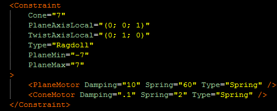

# PlaneMotor

Motor for describing rotation along the Plane axis. See [`<Constraint>`](./../index.md) and [`<Motor>`](./../motor/index.md) for details.

This tag can be used for the `Ragdoll` type of Constraints. The combination of motors on different axes allows you to set different behaviors:

All attributes are the same as in [`<Motor>`](./../motor/index.md).

