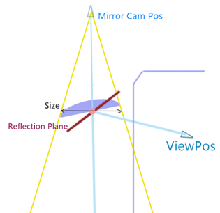
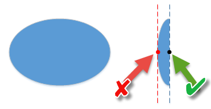

# Mirror

`<Mirror>` tags within [`<Cockpit>`][cockpit] describe mirrors.

The scheme of the operation of the mirror is the following:  

Аs you can see in the picture above, the plane of the mirror (i.e. the plane on its geometrical mesh itself) can be different from the *actual* reflection plane of the mirror. In this case, the normals to these planes (`ClipDir` and `ReflectionDir`, see below) will be different also.

Frustum of the camera of the mirror is defined by:

-   `ViewPos` - the position of the internal camera, defined in [`<Cockpit>`][cockpit].

-   `ReflectionDir` - normal to the *actual* reflection plane of the mirror, from the driver's side of this plane. See `ReflectionDir` in the list of `<Mirror>` attributes below.

-   `Size` parameter multiplied by the `FOVScale` parameter (`Size * FOVScale`).  See these parameters in the list of `<Mirror>` attributes below.

**Attributes:**

-   `MeshFrame="mirror_left"`  
    *(Mandatory.)* Name of the mesh, defined in the FBX file.

-   `Pos="(1; -0.05; 0)"`  
    *(Mandatory.)* Position of the center of the mirror. For convex mirrors, we recommend to specify the position of the center using the coordinates that lie within the plane of the base of the mirror. Usage of the coordinates that lie within the plane touching the "top" of the mirror is not recommended (see the illustration below).

    

-   `ClipDir="(-0.94; 0; -0.342)"`  
    *(Mandatory.)* Normal vector of the plane of the mirror (i.e. the normal to the plane on the mesh itself), from the driver's side of this plane.

-  ` ClipOffset="0.025"`  
    Shift of the clipping plane in the direction of `ClipDir`. This shift is necessary to ensure that the geometry of the mirror itself does not enter the view of the camera.  
    Default value: `0.025`.

-   `ReflectionDir="(-0.963; -0.123; 0.242)"`  
    Normal vector of the *actual* reflection plane of the mirror, from the driver's side of this plane. By default is identical to `ClipDir`.

-   `Size="(0.179; 0.351)"`  
    *(Mandatory.)* The width and height of the surface of the mirror. We recommend you set this width and height `0.01`-`0.02` more than the real size of the mirror. This is necessary to avoid stretching of the image near the edges of the mirror.

-   `FOVScale="1.3"`  
    Scale of the field of view. Actually, this is the scale of the `Size` parameter, which is used during the calculation of the frustum of the camera of the mirror.  
    Default value: `1`.

-   `LookAtOffset="(0; -0.05; 0)"`  
    Shift of the `Pos` position during the creation of the Frustum. This shift is specified in the coordinates of the truck. This parameter is necessary when unwanted geometry elements (e.g. mounts of the mirror) are visible in the mirror reflection.

-   `CurveAngle="10"`  
    Curvature of the texture, in degrees. This parameter allows you to visualize that objects in mirrors look farther than they are. Please, do not set a very high value of this parameter (about `60` degrees is a recommended value). Otherwise, the artifacts near the edges will be visible. Default value: `60`.

-   `UnskinnedCoordinates="false"`  
    The coordinate system in which the mirror parameters are specified. The `false` value means that the coordinates are calculated taking into account the initial transformations of the bones of the skeleton of the truck. The `true` value means that the coordinates are calculated from the positions of the vertices of the mirror. These values correspond to two independent algorithms for calculation of coordinates that are most often indistinguishable.  
    The default value is `false`.

[cockpit]: ./../index.md