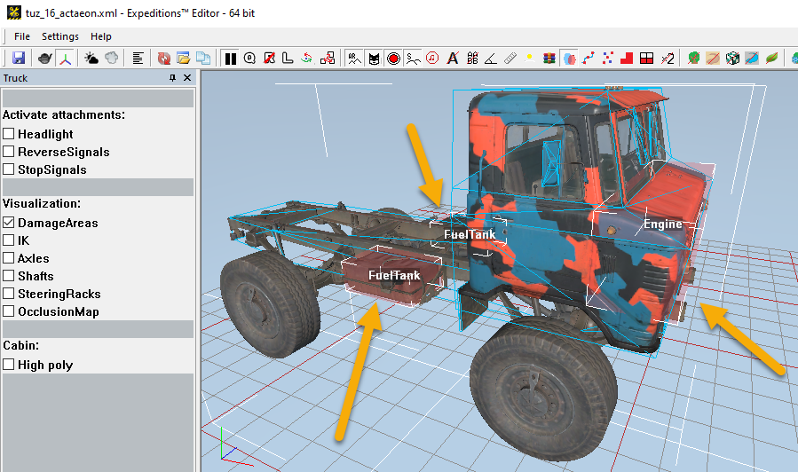

# DamageArea

The `<DamageArea>` tag describes the particular Damage Area of the truck.

*Configured damage areas can be visualized in the Editor:*

The damage area allows us to set the volume, where collision objects of the truck's physical model will *deal damage* to the truck when they collide with other objects.

On the picture above, damage areas are displayed in the form of pink cubes: two **FuelTank** ones and one **Engine**. Their forms and positions can be customized for the gameplay tasks.

For damage area of the **Engine** type, collisions *near* the marked damage area will also deal damage to the truck:

-   Inside the damage zone, the maximum damage (`100%` of it) is dealt.
-   Outside the damage zone, the dealt damage smoothly decreases to `0`.

Thus, the damage to the Engine can be automatically decreased by installing more massive bumpers. 

Therefore, in the front part of the truck, the damage area should be configured quite carefully and should not include bumper add-ons.

Attributes:

-   `Type="Engine"`  
    *(Mandatory.)* Type. Values: `Engine`, `FuelTank`.

-   `Min="(-1; 0.35; -1.2)"`  
    *(Mandatory.)* Lower right back vertex of the damage area cube.

-   `Max="(2; 1.1; 1.2)"`  
    *(Mandatory.)* Upper left front vertex of the damage area cube.

-   `ParentFrame="BoneCabin_cdt"`  
    The bone from the physical model hierarchy, which the damage area is attached to. If the parameter is not specified, then it will be the root bone of the physical model.

