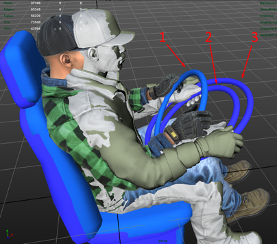
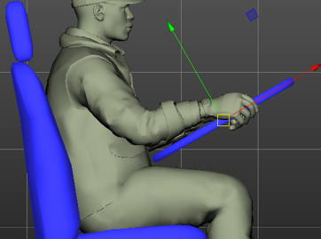

# Driver

The `<Driver>` tag specifies the position of the driver and the animations used for them.

Currently, both *SnowRunner* and *Expeditions* contain three sets of animations for the driver:

-   For scout (**1** on the picture below)

-   For regular truck (**2** on the picture below)

-   For heavy trucks (**3** on the picture below)

These animations differ by the way the driver holds the steering wheel (the larger is the vehicle, the more horizontally is the steering wheel located) and the way they sit.

The driver is affected not only by animations but by physics also. So, to keep the hands of the driver on the steering wheel when the vehicle is moving through bumps, the inverse kinematic is added to his legs and arms. This inverse kinematics holds his hands on the steering wheel and his feet on the floor.

Therefore, despite of the fact that the driver's settings allow you to set the position of hands and the driver himself independently, we recommend that you set these positions strictly in accordance with the animation. And, in the case of poor modeling, tune the driver's seat according to the position of the driver, not vice versa (do not tune the driver according to the position of his seat). Otherwise, the animations can be displayed incorrectly.

The inclination and size of the steering wheel must also correspond to animations.

Attributes:

-   `Pos="(1.173; 1.825; 0.488)"`  
    *(Mandatory.)* Position of the root of the driver.

-   `SteeringWheelPos="(1.555; 2.153; 0.486)"`  
    *(Mandatory.)* Position of the center of the steering wheel.

    

-   `AnimationSet="Scout"`  
    Values: `Scout`, `Truck`, `HeavyTruck`. By default: `Truck`.

-   `ParentFrame="BoneCabin_cdt"`  
    The bone from the physical model hierarchy that the driver is attached to. If the parameter is not specified, the root bone of the physical model.

-   `LegsOffset="(-0.1; 0; 0)"`  
    You can move the legs of the driver, for example, if they visually intersect with the model of the truck.

