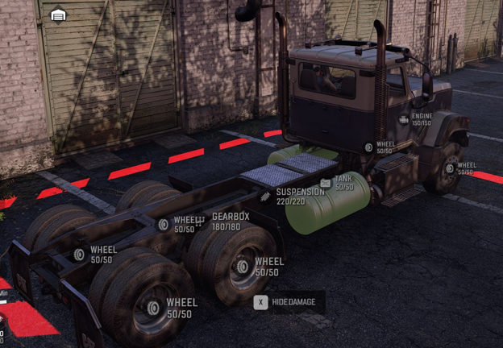

# TruckData

The `<TruckData>` section describes the most properties of the truck itself, not including properties that are related to bone behavior.

Correspondingly, it contains a *lot* of various child tags: [`<Wheels>`][wheels], [`<SuspensionSocket>`][suspensionsocket], [`<EngineSocket>`][enginesocket], [`<Axles>`][axles], and so on.

## Main Attributes
Main attributes of the `<TruckData>` tag are the following:

-   `BackSteerSpeed="0.015"`  
    *(Mandatory.)* After turning, wheels return to their original position. This parameter is the speed with which they return to this position.  
    Value range: `[0.0: 1.0]`.

-   `DiffLockType="Installed"`  
    The differential lock. Values: `Always`. Any other values are not read by the system – they are used purely for easier understanding whether or not the truck has a diff lock addon (`Installed`, `Uninstalled`, `None`).

-   `EngineIconMesh="env/engine_default"`  
    Path to the FBX file of the small model of the semitransparent engine.  
    E.g., `.../meshes/env/engine_default.fbx`, `.../meshes/env/engine_small.fbx`, and so on.

-   `EngineIconScale="1.3"`  
    Scale of semitransparent engine.  
    Value range: `(0.0: 8.0]`.

-   `EngineStartDelay="0.8"`  
    The delay for the start of the engine after the player presses the button that starts it.  
    Value range: `[0.0: 8.0]`.

-   `ExhaustStartTime="0.9"`  
    The start time for the visualization of the exhaust. No explicit limit for the value here.

-   `FuelCapacity="280"`  
    The capacity of the fuel tanks. Integer values only.

    -   *For a truck*: No explicit limit for the value.
    -   *For an addon*: Value rage is `[0: 64000]`.

-   `Responsiveness="0.3"`  
    *(Mandatory.)* The responsiveness of the steering wheel.  
    Value range: `[0.0: 1.0]`.

-   `SteerSpeed="0.025"`  
    *(Mandatory.)* The steering speed of the steering wheel.  
    Value range: `[0.0: 1.0]`.

-   `TruckImage="mytruck_preview_pic"`  
    *For Expeditions:*  
    The preview image of the truck. Used in the UI of the Headquarters and in other places in the UI where the preview image of the truck is necessary (e.g., in the list of Trucks within the Navigational Map). Typically, this image contains the image of the truck on the left side and has the transparent background. Location: In the folder of the mod, in the `/ui/textures/` subfolder. Dimensions: `380 x 92`. Format: `PNG`.  
    *For SnowRunner:*  
    The preview image of the truck. Used in the UI of the Garage.

    **NOTE**: The [`<UiDesc>`](./../gamedata/uidesc/index.md) tag also has attributes that allow you to configure images of the truck.

-   `TruckImageTrade="mytruck_trade_pic"`  (NEW)  
    *(Valid for Expeditions only)*  
    In *Expeditions*, this image is used for the Trade screen of the truck when it is located on the left side of the Trade UI. Location: In the folder of the mod, in the `/ui/textures/` subfolder. Dimensions: `760 x 90`. Format: `PNG`. Typically, these images have the transparent background and the truck displayed at the left side of the image. 

-   `TruckImageTradeRight="mytruck_trade_pic_right"`  (NEW)  
    *(Valid for Expeditions only)*  
    In *Expeditions*, this image is used for the Trade screen of the truck when it is located on the right side of the Trade UI. Location: In the folder of the mod, in the `/ui/textures/` subfolder. Dimensions: `760 x 90`. Format: `PNG`. Typically, these images have the transparent background and the truck displayed at the right side of the image.   

-   `TruckImageSmall="mytruck_small_pic"`  (NEW)  
    *(Valid for Expeditions only)*  
    In *Expeditions*, this small image of the truck is used for the small upper slots in the UI that show trucks selected for the Expedition. Typically, this image has the transparent background. Location: In the folder of the mod, in the `/ui/textures/` subfolder. Dimensions: `124 x 52`. Format: `PNG`.

-   `TruckType="SCOUT"`  
    Values: `SCOUT`, `HEAVY`, `HEAVY_DUTY`, `HIGHWAY`, `OFFROAD`, `SPECIAL`. In *Expeditions*, currently, only the `SCOUT` value is valid, see below.

    **WARNING**: In the current version of *Expeditions*, the `TruckType` value in `<TruckData>` tag should be equal to `SCOUT`. If this type is `HEAVY`, `HEAVY_DUTY`, `HIGHWAY`, `OFFROAD`, or `SPECIAL` – packing will fail. So, currently, please use `SCOUT` for all types of vehicles.

## Addtional Attributes for Status Markers
In *SnowRunner*, along with the attributes listed above, we also use a set of additional attributes for status markers that are displayed for various parts of the truck.

In *Expeditions*, these attributes are not used.

For example, in *SnowRunner*, these status markers may look like this:  

The following additional attributes of the `<TruckData>` tag specify the offsets for these markers:

-   `EngineMarkerOffset="(0.0;0.0;0.0)\"`  
    Offset for the status marker of the engine.

-   `FueltankMarkerOffset="(-3.0;0.0;0.0)"`  
    Offset for the status marker of the fuel tank.

-   `SuspensionMarkerOffset="(-1.0;0.0;-0.5)"`  
    Offset for the status marker of the suspension.

-   `GearboxMarkerOffset="(-1.5;0.0;0.0)"`  
    Offset for the status marker of the gearbox.

If values of these attributes are not specified, then:

-   Status markers of wheels are attached to wheel sockets.

-   The status marker of the suspension is attached to the geometric center between the wheels.

-   The status marker of the gearbox is attached to `0` (it will be displayed in the area of the rear axle).

-   The status marker of the engine is attached to the center of its `DamageArea`.

-   The status marker of the fuel tank is attached to the center of its `DamageArea`.

[wheels]: ./wheels/index.md
[suspensionsocket]: ./suspensionsocket/index.md
[enginesocket]: ./enginesocket/index.md
[axles]: ./axles/index.md