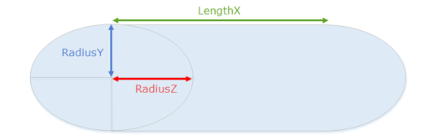

# LimitedFluid

The `<LimitedFluid>` tag describes the semitransparent visualization of the liquid.

Fluids can be displayed within two types of reservoirs only: 

-   in the *Cylinder* with a base perpendicular to the OX axis
-   in the *Cube*. 

The form of the cylinder here is elliptic, i.e. – its base is an ellipse.

Attributes:

-   `Color="(86; 186; 255; 255)"`  
    *(Mandatory.)* The color of the liquid in reservoir. RGBA color, with Alpha corresponding for visibility of the liquid: `0` – not visible, `255` – maximum visibility.

-   `Center="(1.029; 0.7; 0.855)"`  
    *(Mandatory.)* The center of the reservoir.

-   `LengthX="1.34"`  
    *(Mandatory.)* The length of the cylinder. Used only when `Type="Cylinder"`.

-   `RadiusY="0.33"`  
    *(Mandatory.)* The half of the height of the base of the cylinder (the first semi-axis of a cylinder). Used only when `Type="Cylinder"`.

-   `RadiusZ="0.33"`  
    *(Mandatory.)* The half of the width of the base of the cylinder (the second semi-axis of a cylinder). Used only when `Type="Cylinder"`.

    

-   `SizeX="1"`  
    *(Mandatory.)* The length of the box. Used only when `Type="Box"`.

-   `SizeY="1"`  
    *(Mandatory.)* The height of the box. Used only when `Type="Box"`.

-   `SizeZ="1"`  
    *(Mandatory.)* The width of the box. Used only when `Type="Box"`.

-   `Type="Cylinder"`  
    *(Mandatory.)* Type of the reservoir. May be either `"Box"` or `"Cylinder"`.

-   `ParentFrame="BoneCabin_cdt"`  
    The name of the bone from the physical model that the reservoir is attached to. By default, it is the root bone.

