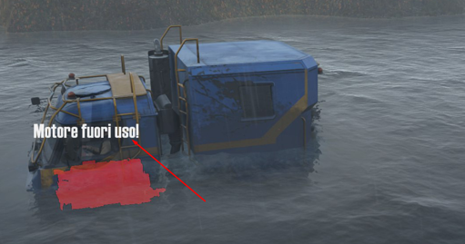

# Messages

The `<Messages>` tag sets up manual positioning of messages about the damage. (`TBD`)

 

Attributes:

-   `Pos="(4.405; 2.804; 0)"`  
    *(Mandatory.)* Position.

-   `ParentFrame="BoneCabin_cdt"`  
    Name of the bone from the physical model, which the message is attached to. By default, the root bone.

