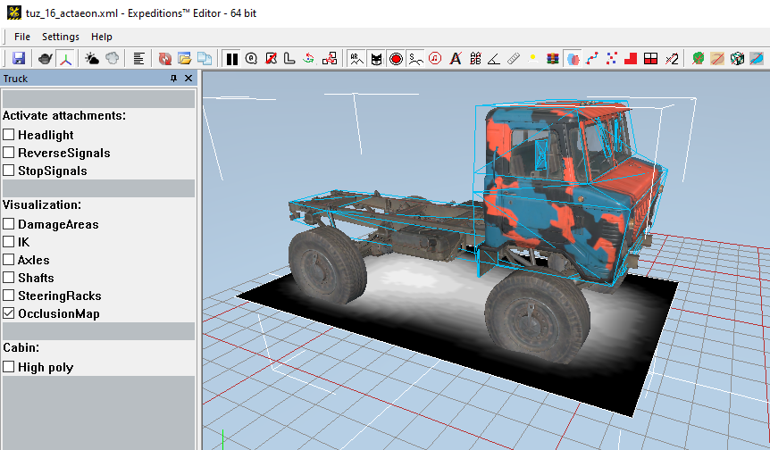

# OcclusionMap

The `<OcclusionMap>` tag describes the fake shadow below the truck.

*Configured Occlusion Map can be visualized in the Editor:*

Attributes:

-   `HalfSizeZ="1.8"`  
    *(Mandatory.)* Half of the width of the occlusion map.

-   `MinX="-4.211"`  
    *(Mandatory.)* Minimum coordinate of the map by `X`.

-   `MaxX="4.51"`  
    *(Mandatory.)* Maximum coordinate of the map by `X`.

-   `ParentFrame="BoneCabin_cdt"`  
    Name of the bone from the physical model, which the map is attached to. By default, root bone.

-   `Texture="trucks/occlusion/example__s_d_a.tga"`  
    Path to the texture file. The default value is: `"trucks/occlusion/chassis__s_d_a.tga"`.

