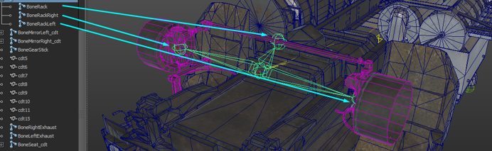

### 8.1.5. \<SteeringRack\>

Steering rack.

There may be multiple tags of this type. For example, when the vehicle has two pairs of wheels that can turn. The parameters for this tag are the following: bone of the steering rack, half of the length of the steering rack, and the bones of the left and right hubs. These bones do not affect the physical behavior of the vehicle, they are needed to assure that the mesh will visually follow the turning of the wheels.

Attributes:

-   Frame=\"BoneRack\"\
    **\*** The name of the bone of the steering rack.

-   FrameSteerLeft=\"BoneRackL\"\
    **\*** The name of the bone of the left hub.

-   FrameSteerRight=\"BoneRackR\"\
    **\*** The name of the bone of the right hub.

-   RackHalfSizeZ=\"0.7\"\
    **\*** Half of the length of the steering rack. This parameter specifies half of the length since the vehicle is typically symmetrical (and it is simply the Z coordinate).

