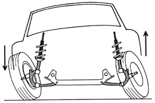

# Wheel

The `<Wheel>` tag contains the description of a particular wheel.

Attributes:

-   `Pos="(-3; 1.2; 1.5)"`  
    *(Mandatory).* Position of the **left** wheel (The Z coordinate must be positive).

-   `RightSide="true"`  
    This parameter makes the right wheel from the left one. (The rim of the wheel is rotated and the tread pattern remains turned in the correct direction). The Z-axis position will be negative.

-   `ParentFrame="BoneCabin_cdt"`  
    The bone (from the hierarchy of the physical model), which the wheel is attached to. If the parameter is not specified, the wheel will be attached to the root bone of the physical model.

-   `ConnectedToHandbrake="true"`  
    The wheel participates in braking when the player presses SPACE.

-   `Location="front"`  
    Values: `front` and `rear`. This parameter is used for wheels of the mixed type (see [Wheel as Set of Tires and Rims](./../../../../../general_info/wheels_description/wheel_as_set_of_tires_and_rims.md)) to identify whether this is a front wheel or a rear one. By default, the value of this parameter is `front`.

-   `Torque="default"`  
    Torque strength.  
    Values:

    -   `default` – this wheel is always a driving one.
    -   `full` – this wheel is a driving one only then the all-wheel drive is enabled.
    -   `none` – this wheel is not a driving one.
    -   `connectable` – whether the wheel is a driving one is defined by the `AllWheelDriveInstalled` parameter of the addon installed to the transfer case.

-   `SteeringAngle="40"`  
    Maximum steering angle when steering.  
    Value: `[-90.0: 90.0]`, by default: `0`.

-   `SteeringCastor="8"`  
    The angle of inclination of the wheel in the direction of rotation, along the OX axis. OX - is the axis going in the direction of the truck movement. (The wheel will be inclined when turning, as shown in the picture below.)
    Value: `[0: 45.0]`, by default: `0`.  
    

-   `SteeringJointOffset="0.23"`  
    The distance along the Z axis from the center of the wheel to the turning point of the wheel.  
    Value: `[-1000.0: 1000.0]`, by default: `fWidth*0.4`, where `fWidth` is the width of the wheel set in the class of the wheel by the `Width` attribute of the `TruckWheels` tag.  
    

-   `SuspensionMin="-0.25"`  
    Minimum value of the suspension drawdown. Value: `[-1000.0: 1000.0]`, by default `0`.
    *(Mandatory.)* This parameter is used and is obligatory only when describing the wheel "as a single entity" (for wheels "as a set of tires and rims", this value is taken from the XML class of the suspension: `<Suspension SuspensionMin="-0.25">`).

-   `SuspensionHeight="0.25"`  
    Height of the suspension.
    This parameter is used only when describing the wheel "as a single entity" (for wheels "as a set of tires and rims", this value is taken from the XML class of the suspension: `<Suspension Height="0.15">`).

-   `SuspensionStrength="0.2"`  
    The stiffness of the suspension. Value: `[0.0: 1000.0]`, by default: `0`.
    *(Mandatory.)* This parameter is used and is obligatory only when describing the wheel "as a single entity" (for wheels "as a set of tires and rims", this value is taken from the XML class of the suspension: `<Suspension Strength="0.15">`).

-   `Type="trailer_sideboard_2"`  
    *(Mandatory.)* The name of the file of the wheel. This parameter is used and is obligatory only when describing the wheel "as a single entity" (for wheels "as a set of tires and rims", this value must be specified in the `<CompatibleWheels Type="wheels_medium_double">` and in the `<Wheels DefaultWheelType="wheels_medium_double">`, if the wheel is the default).

-   `CamberAnglePhysics="0"` (NEW)  
    *(Mandatory.)* The camber angle of the wheels that affects the physical model of the wheel's behavior.  
    Value: `[-30; 30]`, by default: `0`.

-   `CamberAngleRender="3"` (NEW)  
    *(Mandatory.)* The camber angle of the wheels that is used for visual rendering of the truck model in the game. 
    Value: `[-30; 30]`, by default: `0`.

-   `CamberSuspensionMultiplier="1.8"` (NEW)  
    *(Mandatory.)* The multiplier that sets the influence of the wheel camber on the suspension.  
    Value: `[0.3; 3.0]`, by default: `1.0`.

