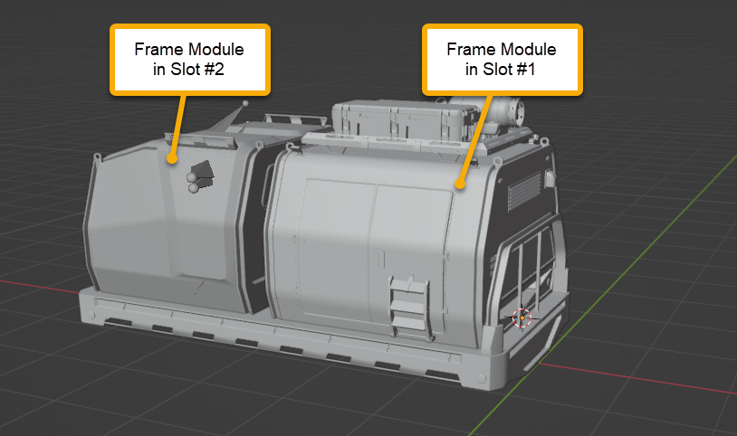
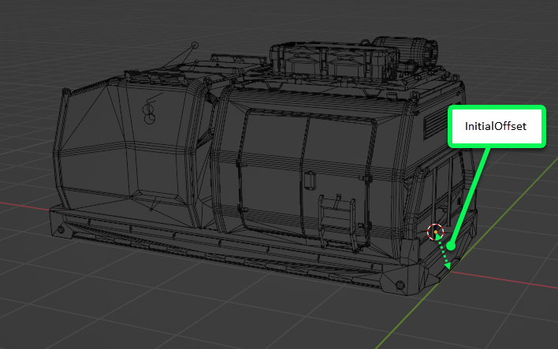
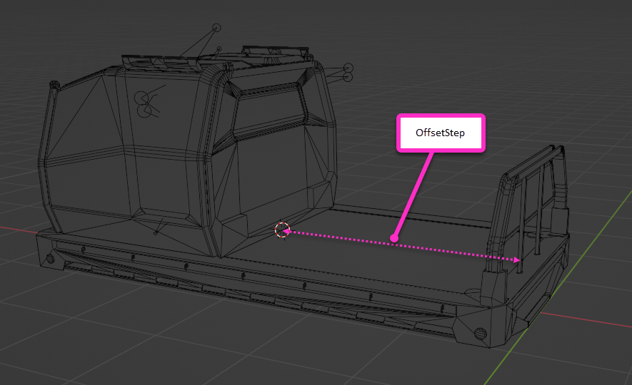

# AddonSlots

*In Expeditions:*  
Description of Addon Slots of the frame addon where frame modules can be placed.

*In SnowRunner:*  
Description of Addon Slots of the addon where cargo items ("Cargo Addons", i.e. Cargo in a state when it is already loaded to the truck) can be placed.

These slots are virtual areas on the addon/trailer where frame modules (*Expeditions*) or cargo items (*SnowRunner*) can be placed.

Attributes:

-   `InitialOffset="(-0.15; 0.46; 0)"`  
    The coordinate of the 1st slot, in the coordinates of the truck/frame addon/trailer. Using this value and the `OffsetStep` (see below), the system will be able to identify the coordinates of all slots. 

    
    
    **NOTE**: The value of this attribute depends on the locations of origins of the frame modules/Cargo Addons that you will use with this frame addon. For example, in Expeditions, origins of frame modules for the flatbed are typically in the center of their first lower edges, so the `InitialOffset` of the flatbed is configured correspondingy. If the origins of these frame modules were, say, in the centers of their bottom surfaces, the `InitialOffset` of the flatbed would be configured differently.

-   `OffsetStep="(-2.486; 0; 0)"`  
    This attribute sets the distance between two adjacent slots, used to identify coordinates of all other slots by the coordinate of the 1st slot. Please note that the negative values (e.g. `"(-2.559; 0; 0)"`) can also be specified in this field and the sign of these values specifies the direction in which the next slot is located (if there are multiple slots).

    

-   `ParentFrames="BoneCargo_2_cdt,BoneCargo_1_cdt,BoneCargo_1_cdt"`  
    *(Optional.)* Bones of the truck/frame addon/trailer these slots are attached to (the order corresponds to the order of the slots). When you specify `ParentFrames`, the number of bones listed for slots should be the same as the value of the `Quantity` field (see below). If multiple slots are attached to the same bone, it should appear in the list multiple times (like in the value of the attribute above). If you omit the `ParentFrames` attribute, all slots will be attached to the root bone.

-   `Quantity="2"`  
    The number of slots. Must correspond to the number of bones listed in `ParentFrames`, if it is not omitted.

