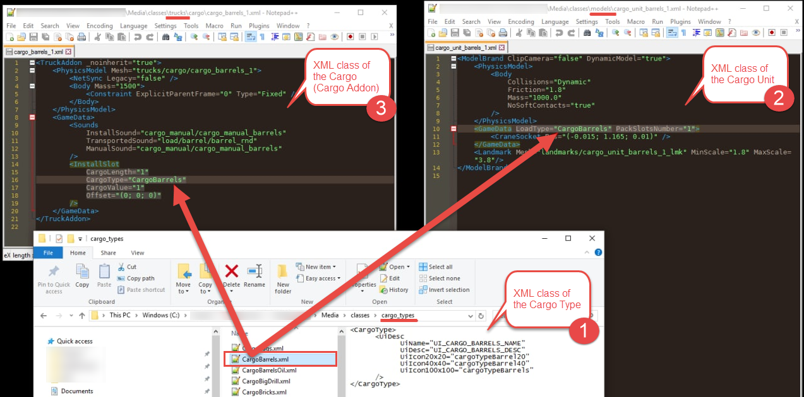

# InstallSlot

*For Expeditions:*  
Installation slot for a frame module that is installed to this addon.

*For SnowRunner:*  
Installation slot for a Cargo Addon (Cargo in its packed state when it is loaded to a truck) on this addon.

Attributes:

-   `CargoLength="1"`  
    The number of [slots](./../../gamedata/addonslots/index.md) that are filled by this frame module or Cargo Addon when it is within a truck or a trailer.

-   `CargoType="Addon"`  
    *For Expeditions:*  
    Frame modules are addons, so you need to specify `Addon` as a value of this attribute for frame modules.  
    *For SnowRunner:*  
    The Cargo Type of this Cargo Unit. Here you need to specify the name of the necessary Cargo Type XML class file without the extension, e.g. `CargoBarrels` for `CargoBarrels.xml`. This field links the Cargo Addon to the Cargo Type and, through it, to the Cargo Unit, see the illustration below.

    

-   `CargoValue="1"`  
    Currently not used, can be omitted or set to `1`.

-   `Offset="(0; 0; 0)"`  
    The offset for the "1st slot" of this frame module or Cargo Addon. I.e., offset for the point where it will be attached to the 1st [slot](./../../gamedata/addonslots/index.md) of the truck/frame addon/trailer. If you have modeled the frame module or Cargo Addon so that the position of this point is in the origin of the FBX file, you can set this offset to `(0; 0; 0)`. 
