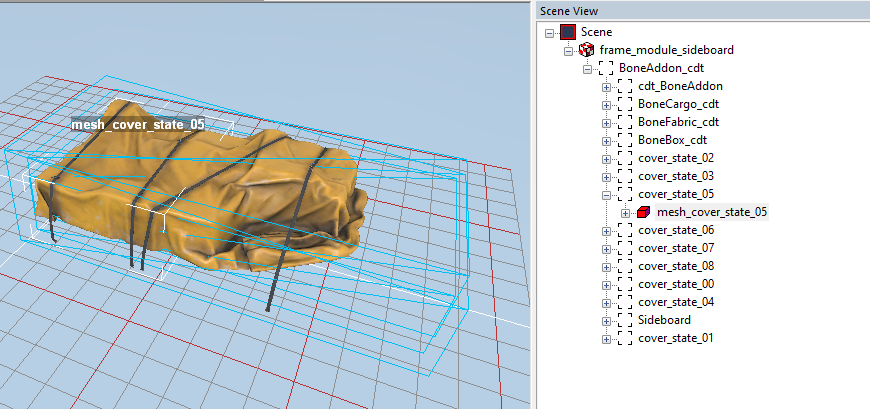

# Mesh

*(NEW) This tag is valid for Expeditions only.*

Every `<Mesh>` tag within `<HeavyInventorySlotsMeshes>` corresponds to a visual mesh that shows a certain state of [Cargo Slots](./../../../../new_features/cargo_slots.md) that can be filled with "packed luggage".

For example, the 0 mesh will correspond to an empty sideboard, the 1st mesh will correspond to the 1st such slot filled with the abstract inventory, the 2nd one – to the *1st and 2nd slots* filled with inventory, the 3rd one – to the *1st, 2nd, and 3rd slots* filled with it, etc.

**NOTE**: These meshes should be created in the FBX of the addon. The path and name of the FBX itself is taken from the `Mesh` attribute of the [`<PhysicsModel>`](./../../physicsmodel/index.md) of the addon.  

See [Cargo Slots](./../../../../new_features/cargo_slots.md) for details.

Attributes:

-   `Frame="cover_state_05"`  
    The name of the visual mesh corresponding to a certain state of Cargo Slots, see above.

-   `HideThreshold="5"`  
    The amount of filled Cargo Slots that should be filled to display this mesh. If the amount of filled slots is lower, the visual mesh will become hidden.
