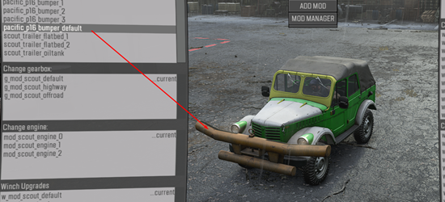
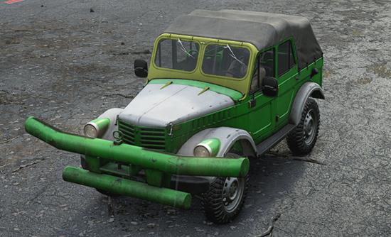
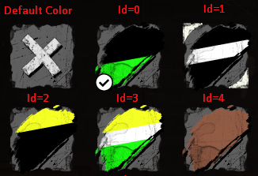
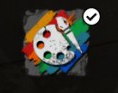

# CustomizationPreset

The `<CustomizationPreset>` tag describes the customization preset used during [Color Customization](./../../../../additional_info_on_trucks/color_customization/color_customization.md).

**NOTE**: For general info on Color Customization of the truck, see [Color Customization](./../../../../additional_info_on_trucks/color_customization/color_customization.md).

This tag creates the customization preset, i.e. specifies particular colors for the zones that you marked for painting in the `TintMap` attribute in the [`<MaterialOverride>`](./../../../combinexmesh/materialoverrides/materialoverride/index.md) tag. 

To link the color preset to the overrides of the necessary materials, you need to set in the `MaterialOverrideName` attribute of the `<CustomizationPreset>` tag the same value that you have specified in the `Name` attribute of the `<MaterialOverride>` tag.

Along with colors, in each preset, you need to specify the identifier of the color button in the Garage, which will enable your customization of the vehicle with these colors applied.

**NOTE on Addons**: The color can be changed both for the truck and for its addons. You do not need to create customization presets for addons, color settings for them are taken from the color settings of the truck.
For example, in the pictures below, the bumper from *Pacific P16* is installed on *TUZ 166*. `MaterialOverrides` are configured on Pacific P16 and, along with that, there is also an override with the `skin_00` name, which is also configured for TUZ 166. Therefore, after the installation of this bumper to TUZ 166, this bumper is colorized with the color of the truck.

Attributes:

-   `MaterialOverrideName="skin_00"`  
    Name of the override of the material, which is defined in the XML of the mesh of the truck, in the `<MaterialOverride>` tag (in its Name attribute).

-   `Id="0"`  
    Identifier of the color button in the Garage. The sequence of these identifiers starts with zero. You should not use the same identifier twice (it must be unique) and you should not skip numbers in the sequence of identifiers. In the case of a duplicated identifier, the value of the preset will be ignored by the game. If you skip some values in the sequence of identifiers, the game will create superfluous non-functional buttons for the skipped values.
    
    

-   `TintColor1="g(117; 18; 38)"`  
    The color of the first layer. It is applied to the texture using the **R**-channel mask of the `TintMap`, which is defined in the [`<MaterialOverride>`](./../../../combinexmesh/materialoverrides/materialoverride/index.md) tag.

-   `TintColor2="g(117; 18; 38)"`  
    The color of the second layer. It is applied to the texture using the **G**-channel mask of the `TintMap`, which is defined in the [`<MaterialOverride>`](./../../../combinexmesh/materialoverrides/materialoverride/index.md) tag.

-   `TintColor3="g(117; 18; 38)"`  
    The color of the third layer. It is applied to the texture using the **B**-channel mask of the `TintMap`, which is defined in the [`<MaterialOverride>`](./../../../combinexmesh/materialoverrides/materialoverride/index.md) tag.

-   `IsSpecialSkin="true"`  
    This option marks this color preset as a special one, which may be necessary to attract the player\'s attention to it. Buttons of special presets are displayed with the "palette and brush" icon on them (see below).  
    Default value: `false`.  
    

