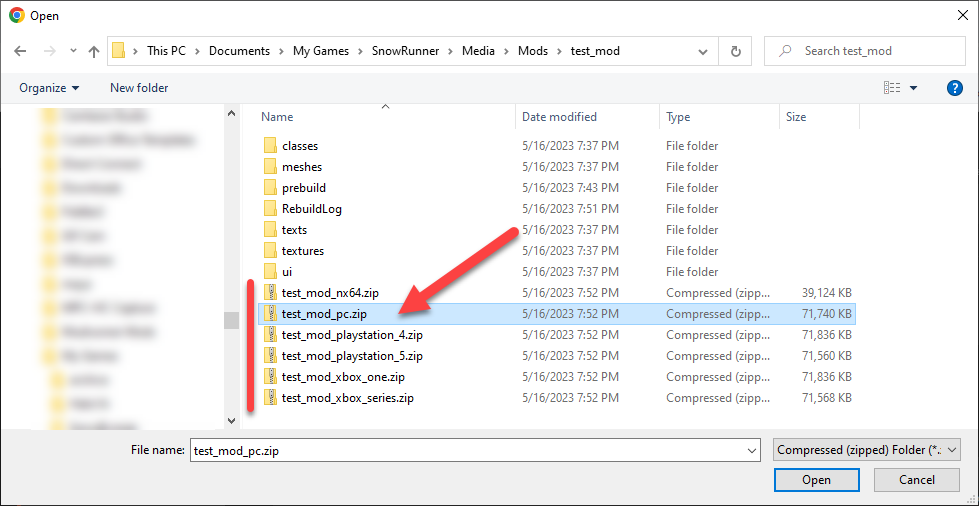
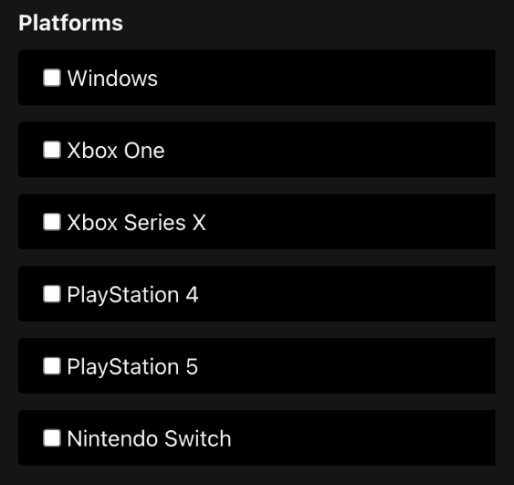
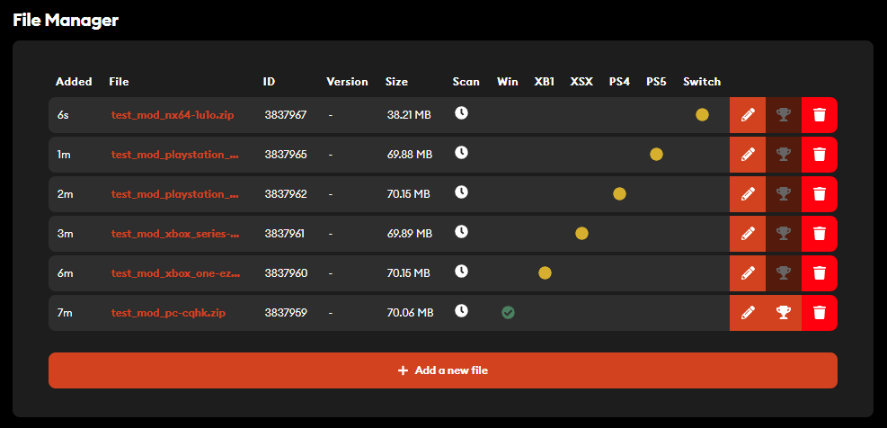
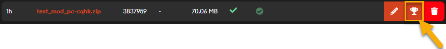

## 4.3. Uploading Files of the Mod

On the **Edit Your Mod** page (available for the created mod via **MOD ADMIN \> SETTINGS**) -- most importantly -- you need to upload files of your mod.

At the top of the page, you will see a message requesting you to upload files of the mod (it is unusable without files) -- along with the **Add file** button. Clicking this button will focus you on the **File Manager** section of the page that allows you to upload files of your mod.

In the **File Manager** section, do the following ***for every .zip archive of a particular platform*** that you have generated during packing of your mod -- see [3.6. Packing a Vehicle Mod](#packing-a-vehicle-mod) for details:

1.  Click **Select zip file**.

2.  Locate the necessary .zip file of the mod *corresponding to the particular platform*.\
    \
    For a vehicle mod, this file will be the zip file of the particular platform in the ***folder of your mod*** within the **Mods** folder. E.g., in our sample case, these .zip files of platform versions will be located at **...\\Documents\\My Games\\SnowRunner\\Media\\Mods\\test_mod\\\
    \
    **

> Map mods also have separate .zip archives for different platforms that are generated during packing. Particularly, for separate map mods (*not* Regions), these zip files are located at:\
> **...\\Documents\\My Games\\SnowRunner\\Media\\levels**. And, for Regions with multiple maps, they can be located at **...\\Documents\\My Games\\SnowRunner\\Media\\Mods**. For details, see \"**SnowRunner™ Editor Guide**\" guide, available as **SnowRunner_Editor_Guide.pdf** in the same documentation package.\
> \
> **WARNING**: To upload a mod to mod.io correctly -- you need to upload *every .zip file* *of every platform* ***as a separate file*** on the **Edit Your Mod** page at mod.io. Otherwise, you mod may be not usable, may not pass the mod review process and will not be available for consoles.\
> \
> **NOTE**: If you are uploading neither a regular vehicle mod, nor a regular map mod, but some other files that should be installed manually, you can provide a single .zip archive of these files and mark that it requires manual installation.

3.  In **Platforms** -- tick the platform that is supported by the *uploaded .zip file of the mod*.\
    \
    For example, in our case, if you have uploaded the **test_mod_pc.zip** file, select *only* **Windows**. Or, if you have uploaded **test_mod_nx64.zip** file, select *only* **Nintendo Switch**. And so on. Remember that every .zip file generated during packing of a regular vehicle mod or a regular map mod corresponds to one platforms *only*.\
    \
    **WARNING**: Please do not select any platforms the uploaded .zip file is not compatible with. And, please do *not* archive all generated .zip files into one single .zip and tick all platforms.\
    \
    

4.  *(Optional step)* In **Version** -- if necessary, specify the version of the uploaded .zip file.

5.  *(Optional step)* In **Changelog** -- if necessary, specify the changelog for the uploaded .zip file.

6.  If you want to make your mod public and available on the specified platforms directly after received approval on these platforms (for every platform separately), select the **Make this release live for approved platforms** option. If you want your mod to remain hidden and mod versions unavailable to the player even after their approval, clear this option (by default it is selected).

7.  Select the **I agree to the terms and privacy policy** option to agree to the Terms of Use and Privacy Policy of mod.io. This is a required option. If necessary, you can review these documents by clicking the corresponding links in the name of the option.

8.  Click **Upload**. This will start the upload of the specified .zip file. After it is finished, the table with the details of the uploaded file and ability to manage it will appear.\
    \
    Along with it, you will see the notification message informing you that the zip file for the platform was uploaded successfully and that it will be moderated, if platform requires it. ("*A file was uploaded successfully. A moderator will review platforms that require moderation. You will be notified once the approval process is completed.*")

9.  To upload the next .zip file (for the next platform), click **Add a new file** below the table.

After uploading all platform .zp files, the table with your files will look similarly to the following:

You can see that "**Windows**" platform version was automatically approved and has changed into green which means it is approved. All of the other platforms are pending approval, which means they need to be checked by someone on the moderation team of SnowRunner, to ensure they are compatible with the platforms chosen (read more about [Console Mods Requirements](https://forums.focus-entmt.com/topic/57557/console-mods-requirements)).

> **TIP**: If you point to the green or yellow circle in the table, the current state of the file will be displayed in the tooltip.

Once that check has been completed, those files will be approved. If the **Make this release live for approved platforms** option was turned on, these files would become live too, directly after approval. Remember that you can only have one file live or pending to go live (green or yellow) per platform, so as you upload newer builds, your new files will turn green, and your old files will turn white, so you can see which is the current live version on each platform.

> **NOTE**: If files of the mod (its console verisons) are updated at mod.io -- they will need to pass the approval process once again.

Once you have uploaded your files, you can wait until they become approved, modify existing settings of the mod (described before in [4.2](#specifying-initial-info-of-the-mod)) and fill in other fields of the mod (see [4.4](#optional-steps-dependencies-and-media)), if necessary.

You can also **Edit** file properties and **Delete** it, using buttons displayed next to its row on the right side of the table.

After these files are approved, you can make them live by clicking the **Set file live** button next to them:

However, making files live makes them available only with the scope limited by the **Visibiltity** (see [4.2](#specifying-initial-info-of-the-mod) above).

So, if the **Visibilty** of your mod was marked as **Hidden**, even the "live" files will still only be available to current subscribers and team members (see [4.7](#optional-steps-mod-team-and-preview-feature) below). However, you can change the **Visibilty** of the mod as a whole and make it **Public**, see [4.5](#making-your-mod-live-at-mod.io) below.

If the **Visibility** of the mod was set to **Public**, "live" files will become actually live and available to all players on the corresponding platform.

