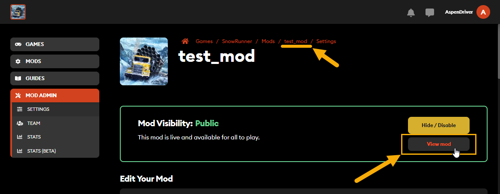
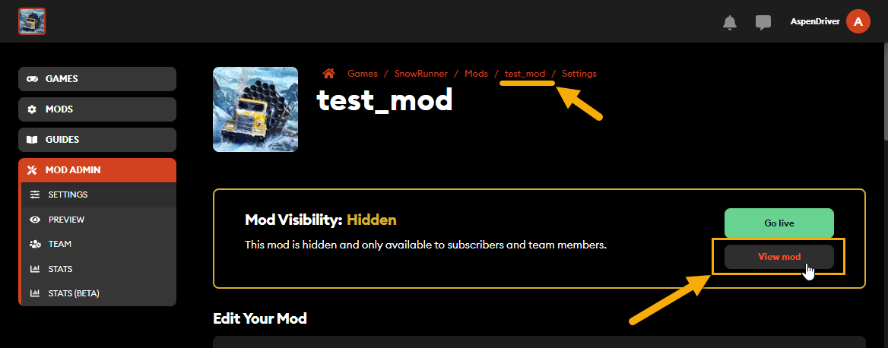

## 4.4. Opening the Profile Page of Your Mod at mod.io

Whether or not is your mod is public, it may be a good idea to check out its profile page, to ensure that all is correct there (uploaded and "live" files are displayed as available, images look correct, and so on).

You can open the page of your mod at mod.io by doing one of the following:

-   From **MOD ADMIN** **\> SETTINGS** page, you can either click the **View mod** button displayed within the **Mod Visibility: Public / Hidden** section or click the name of your mod in the breadcrumbs section displayed at the top of the page.\
    \
    

-   Or, you can open the link displayed at the **Profile URL** field in the mod **SETTINGS** in your browser.

-   Or, if your mod is hidden and the preview access (see [4.7](#optional-steps-mod-team-and-preview-feature)) is enabled -- you can use the **Preview URL** of the **MOD ADMIN \> PREVIEW** page.

-   Or, if your mod is live and public, you can find it using regular search at <https://mod.io/g/snowrunner> or within the Mod Browser in the game itself.

The profie page of the mod displays the summary of your mod and has the **SUBSCRIBE** button, which allows players to subscribe to it. If your mod is hidden, you can make it public from this page.

