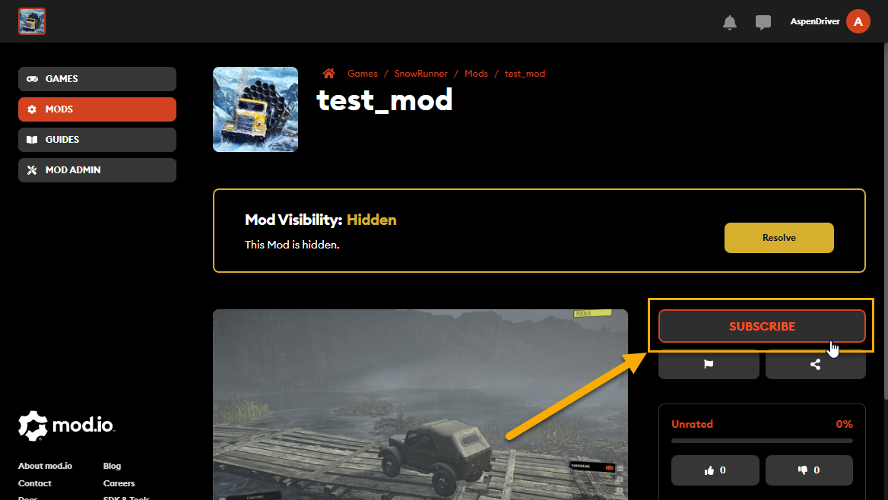
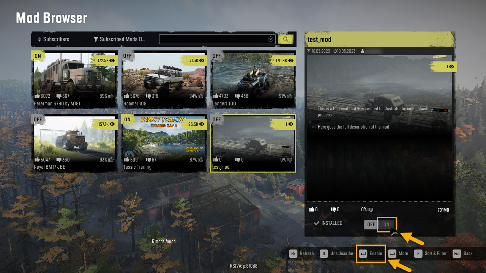

## 4.8. Subscribing to Your Mod from mod.io Site

After you have successfully uploaded the mod and tuned its settings, you can open its profile page (see [4.4](#opening-the-profile-page-of-your-mod-at-mod.io) above) and subscribe to it.

> **NOTE**: Subscription to a mod is necessary for adding it to the game, see section [5.](#usage-of-mods-from-mod.io) below.

To do that, click **SUBSCRIBE** button on this page.

After subscribing, your mod will appear in the game, in the **MOD BROWSER** (you can enable the **Subscribed Mods Only** filter to locate it there more easily).

To enable it in the game, locate it in the list of mods there and switch its state to **ON**.\
For more details, see section [5.2](#activating-a-mod) below.

Finaly, after you have thoroughly tested your mod, you can make it Public, see [4.5. Making Your Mod "Live" at mod.io](#making-your-mod-live-at-mod.io) above for details.

