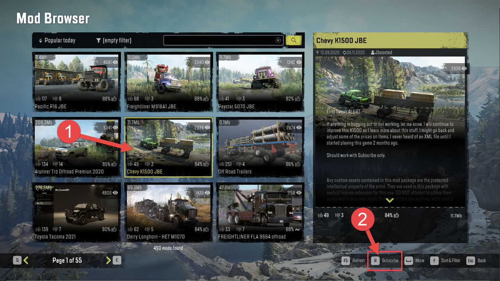
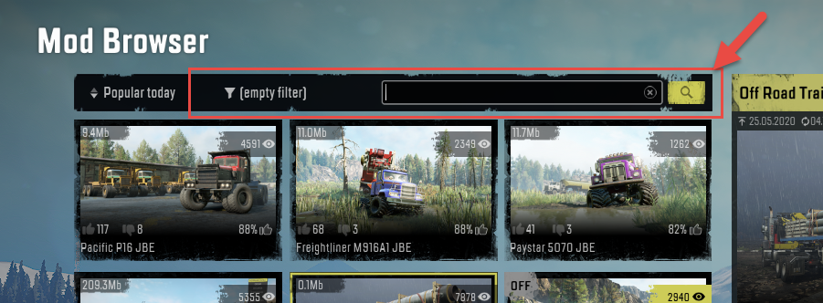
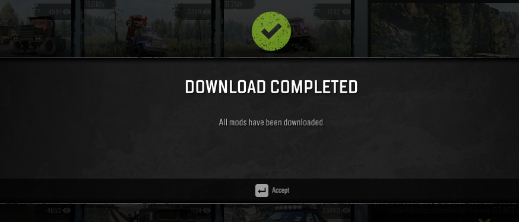

## 5.1. Subscribing to a Mod

To subscribe to the mod:

1.  Open the game, then open **MOD BROWSER** in the main menu.

2.  In the **MOD BROWSER**, select the necessary mod in the list (**1**) and click **Subscribe** command (**2**) in the lower right corner of the window.

> **NOTE**: To locate a mod, you can use filters and the search bar displayed above the list of mods:
>
> 

After the subscribed mod has been downloaded, the game will notify you with the corresponding message:

After that, you will need to find this mod in the list of subscribed mods and [activate it](#activating-a-mod) (see below).

Alternatively, you can use the SnowRunner's mod.io website for subscription:

1.  Open <https://mod.io/g/snowrunner> in a browser, while being logged in with the mod.io account you [have linked](#registration-and-authentication) to the game.

2.  On this site, open the profile page of the necessary mod.

3.  Click **SUBSCRIBE**.

