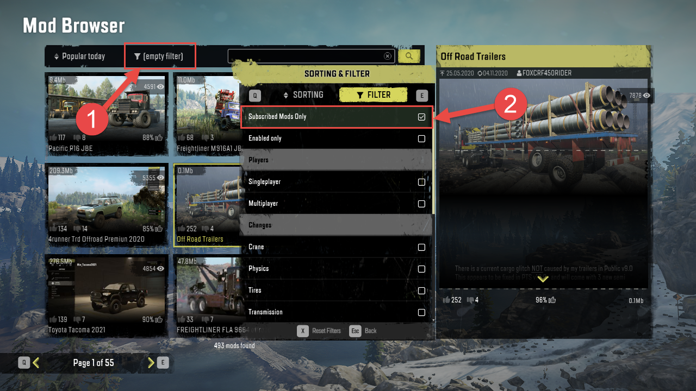
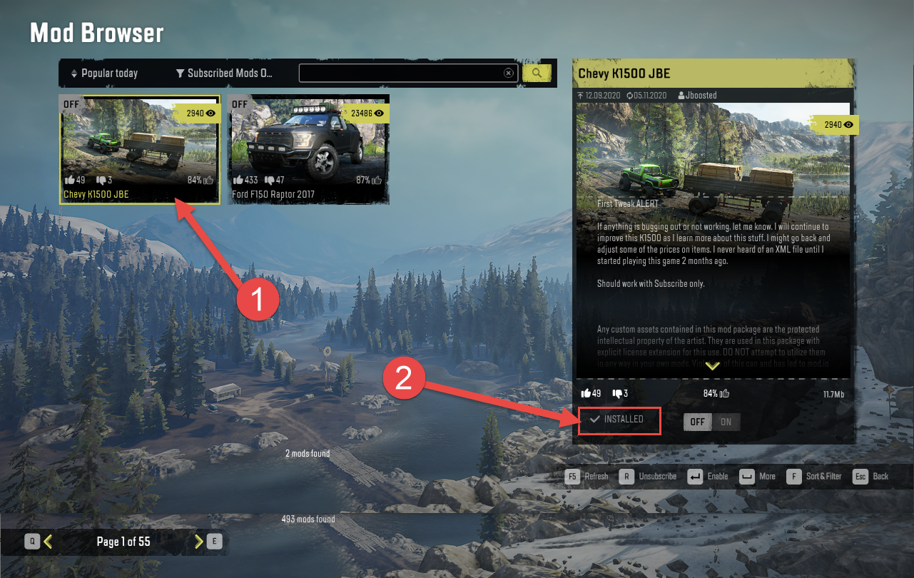
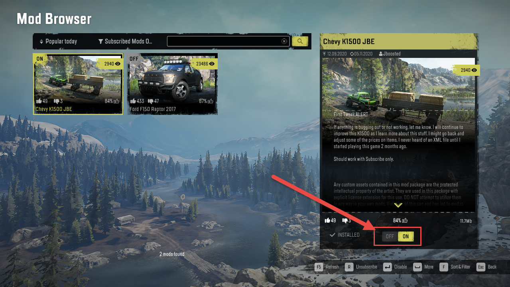
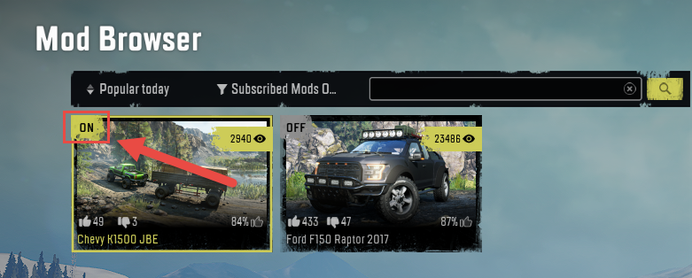

## 5.2. Activating a Mod

To activate the mod you have been subscribed to:

1.  In the **MOD BROWSER**, click the filter button located above the list of mods (**1**) and enable the **Subscribed Mods Only** filter (**2**) in the appearing **SORTING & FILTER** dialog.

Press ESC to close this dialog and apply the filter.

2.  In the appeared list of the mods you are subscribed to, locate the necessary mod and click it to show its details (**1**). Ensure that its status is "INSTALLED" (**2**), which means that the mod has been downloaded and is ready for activation.

3.  Enable the mod, either by clicking the **Enable** command in the lower right corner of the window or by switching its **OFF/ON** switcher to **ON**.

After doing this, the mod will be activated in the game and you will be able to use the vehicle from it on any map. It will be available in the truck store in any Garage.

Activated mods are marked by the **ON** label in the list of mods:

