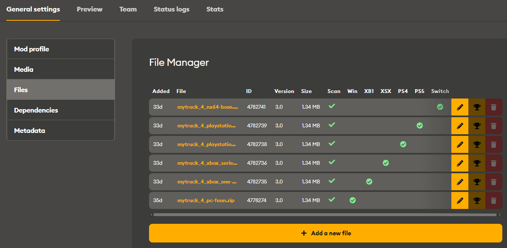

# Console Mods Approval Process

In order to comply with console vendors standards, all mod versions for consoles pass the review before they become available to players.

The main pipeline of this process is the same for both *Expeditions* and *SnowRunner*. It is performed with on the mod.io platform.

## Viewing Statuses
After submitting console-targeted `.zip` files of your console mods, you can view their statuses when editing the mod properties, in **General settings** \> **Files** ("**File Manager**") table.

Please note that the process of testing and approval is gradual, not instant, and requires work from the development team. 

## Main Requirements
Below you'll find a list of all the hard requirements for mods to be eligible for console. 

Please note that this doesn't automatically mean they will be added, only that they are not precluded.

-   Brands: 
    -   No *new* branded vehicles on consoles for even allowed brands.
    -   Only *tweaks* of branded vehicles *that are available in the game* (i.e. in *SnowRunner* or *Expedetions*) are allowed on consoles and *only for those brands that are not prohibited* (see below).
    -   Brands that are prohibited on consoles are below. Brands that are not prohibited are allowed.
        The list of brands prohibited for consoles:
        -   For *SnowRunner*:
            -   Caterpillar
            -   GMC
            -   Hummer
            -   Chevrolet
            -   Jeep
            -   Landrover
            -   Rezvani
            -   Mack
            -   Kenworth
            -   Ford
        -   For *Expeditions*:
            -   N/A (however, see the limitations above)           
-   Mods of DLC/Season Pass Trucks are allowed for consoles, if they follow our [Modding of DLC Trucks][dlc_trucks_policy] policy.  
-   No offensive or inappropriate content.
-   Mod titles and descriptions need to be in English.
-   Special characters are not allowed (such as `^`, `/`, `%`, etc.)
-   A mod can't surpass `1` GB in size.
-   A mod must have no visible glitches or render bugs.
-   A vehicle mod must allow the player to progress through the game to some extent and must be possible to play without any blocking issues. Before making a mod available, we will test this on our side.
-   All textures of materials of a vehicle mod must be named according to the correct naming scheme. For details, see the description of the [`<Material>`][material] tag. This naming scheme is necessary to enable streaming for textures of the mod, which may be essential. Mods with the wrong names of textures result in memory leaks on consoles (and these mods will not be approved for consoles).

## Technical Requirements
*Technical* requirements and recommendations on creating mods for consoles are the same for both games.

They can be seen in the short [Console_Requirements_for_Mods.pdf][console_requirements_for_mods_pdf] guide created for *SnowRunner*.

[material]: ./../truck_modding/tags_and_attributes_of_trucks/combinexmesh/material/index.md
[console_requirements_for_mods_pdf]: ./files/Console_Requirements_for_Mods.pdf
[dlc_trucks_policy]: ./../truck_modding/additional_info_on_trucks/modding_of_dlc_trucks/modding_of_dlc_trucks.md